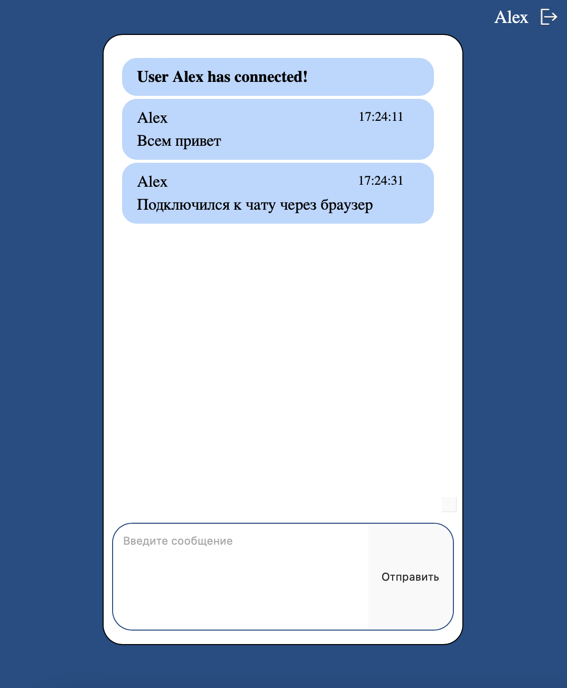
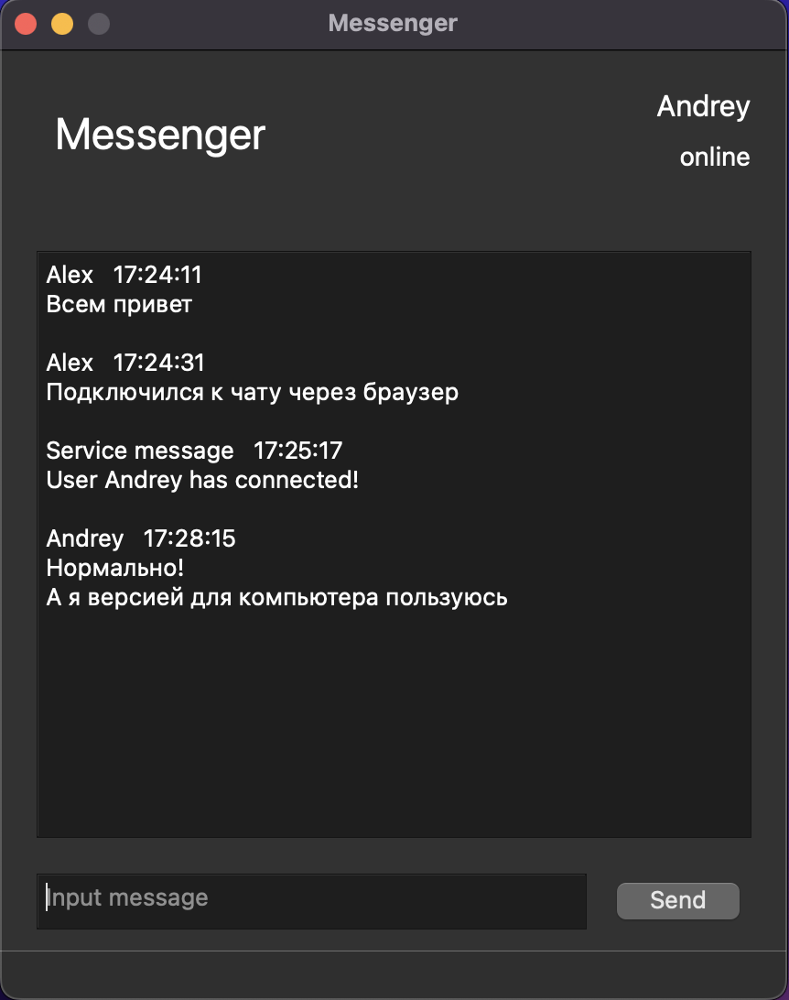
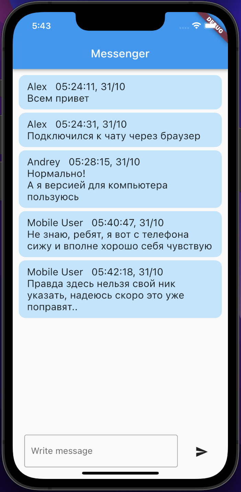

Simple chat application that has a web client, a desktop app made with PyQt, and Flutter mobile version   
====
Messages are exchanged using sockets, the dialogue is stored in the database

The desktop and web versions have user registration and authorization  
Now in the mobile version this functionality is under development

___

